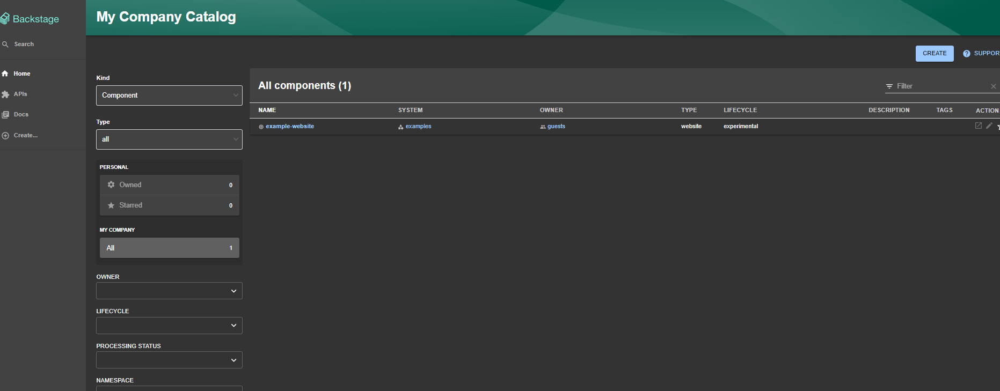

1. setup your backstage app:
```
npx @backstage/create-app@latest
```

2. go to the backstage folder, and in the "app-config.yaml", do the following changes: 

* 2.1 set "app.baseurl" from "http://localhost:3000" -> "http://0.0.0.0:3000"

* 2.2 under "backend.listen" set a field called "host" to "0.0.0.0"

the configuration should now, look like this:
```
app:
  title: Scaffolded Backstage App
  baseUrl: http://0.0.0.0:3000

organization:
  name: My Company

backend:
  # Used for enabling authentication, secret is shared by all backend plugins
  # See https://backstage.io/docs/auth/service-to-service-auth for
  # information on the format
  # auth:
  #   keys:
  #     - secret: ${BACKEND_SECRET}
  baseUrl: http://localhost:7007
  listen:
    port: 7007
    host: 0.0.0.0
```

2. go to the backstage folder
```
cd <my-backstage-app-name>
```
3. run the frontend:
```
yarn dev
```
4. in another terminal, in the same folder, run the backend:
```
yarn workspace backend start
```
5. your backstage guest app should be running with guest authentication!

